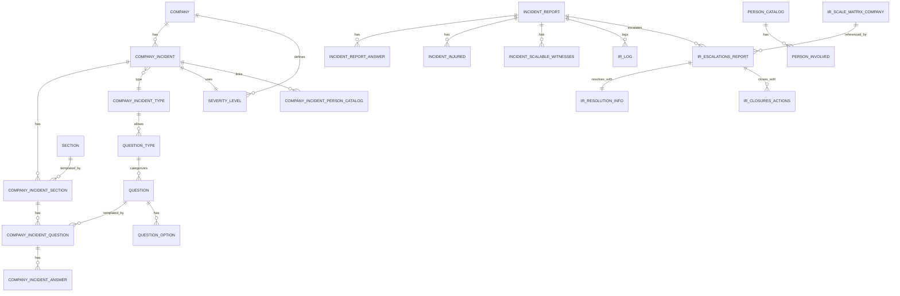

# Incident Module Data Model (ERD/Class Diagram)

This document provides an initial Entity-Relationship overview and class-style diagram notes for the Incident module. It focuses on tables inferred from Doctrine entities and their likely relationships. Adjust as we confirm exact mappings from Doctrine metadata.

## Mermaid ERD (Starter)



## Key Entities and Purpose

- COMPANY_INCIDENT: Company-scoped incident configuration and linkage to types, forms, severity.
- COMPANY_INCIDENT_TYPE: Defines incident types per company; may include subtypes.
- COMPANY_INCIDENT_SECTION: Sections associated to the incident configuration (form layout).
- COMPANY_INCIDENT_QUESTION: Questions tied to sections; supports different QUESTION_TYPE.
- COMPANY_INCIDENT_ANSWER: Stored answers for company incident form data (configuration or defaults).
- SECTION / QUESTION / QUESTION_TYPE / QUESTION_OPTION: Template catalogs used to build custom forms.
- SEVERITY_LEVEL: Company severity catalog; associated to incidents.
- INCIDENT_REPORT: Concrete user-submitted incident report (tracking lifecycle).
- INCIDENT_REPORT_ANSWER: Answers tied to a specific incident report.
- INCIDENT_INJURED / PERSON_INVOLVED / INCIDENT_SCALABLE_WITNESSES: People related to a report.
- IR_ESCALATIONS_REPORT: Escalation path records for a report.
- IR_RESOLUTION_INFO: Resolution details for escalated incidents.
- IR_CLOSURES_ACTIONS: Closure actions associated to escalations.
- IR_LOG: Activity log for incident reports.
- IR_SCALE_MATRIX_COMPANY: Escalation matrix per company.
- COMPANY_INCIDENT_PERSON_CATALOG: Link table relating company incidents to person catalog entries.
- PERSON_CATALOG: Generic person catalog used across incidents.

## Class Diagram Notes (Relationships & Fields)

For each entity, document:
- Primary key (e.g., `id`)
- Core fields (names, types, nullable)
- Foreign keys and relations (OneToMany, ManyToOne, ManyToMany)
- Indexes and constraints (unique, composite)

Example (template):

```
Entity: INCIDENT_REPORT
- id: int, PK
- company_id: int, FK COMPANY
- incident_type_id: int, FK COMPANY_INCIDENT_TYPE
- severity_level_id: int, FK SEVERITY_LEVEL
- status: enum (draft/submitted/in_review/escalated/resolved/closed)
- created_at: datetime
- updated_at: datetime
Relations:
- answers: OneToMany INCIDENT_REPORT_ANSWER
- injured: OneToMany INCIDENT_INJURED
- witnesses: OneToMany INCIDENT_SCALABLE_WITNESSES
- logs: OneToMany IR_LOG
- escalations: OneToMany IR_ESCALATIONS_REPORT
Indexes:
- (company_id, status)
- (incident_type_id)
```

## Next Steps

- Extract precise field names and relations from Doctrine annotations/YAML/XML:
  - `symfony/src/Incident/*/Entity/*.php`
- Add per-entity specs in `docs/entities/*.md` with field tables and relation diagrams.
- Validate ERD by cross-checking repositories and services for join logic.
- Add keys/indexes section based on migrations.

## References

- Configuration entities: `symfony/src/Incident/ConfigurationBundle/Entity/*.php`
- Creation entities: `symfony/src/Incident/CreationBundle/Entity/*.php`
- Tracking entities: `symfony/src/Incident/TrackingBundle/Entity/*.php`
- Repositories: `symfony/src/Incident/*Bundle/Repository/*.php`
- Services that imply relations: `symfony/src/Incident/*Bundle/Service/*.php`
